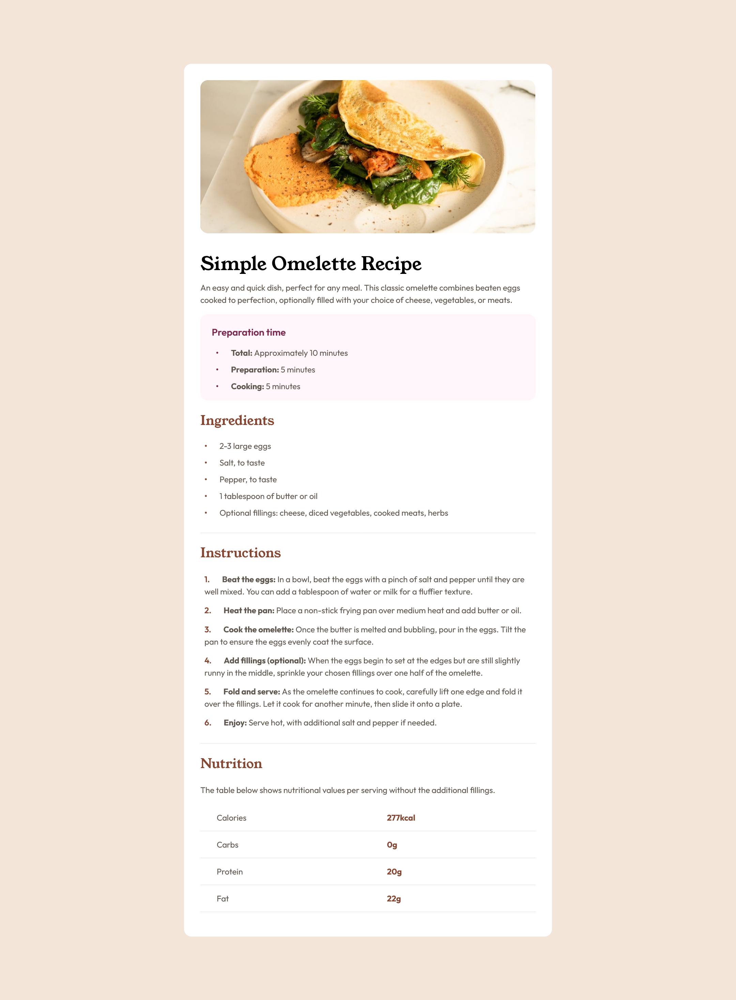

Recipe page

Welcome! 👋

Thanks for checking out this front-end coding challenge.

Frontend Mentor - Recipe page solution

This is a solution to the [Recipe page challenge on Frontend Mentor](https://www.frontendmentor.io/challenges/recipe-page-KiTsR8QQKm). Frontend Mentor challenges help you improve your coding skills by building realistic projects. 

Table of contents

- [Overview]
  - [The challenge]
  - [Screenshot]
  - [Links]
- [Author]
- [Acknowledgments]

Screenshot

Links

- Solution URL: [https://github.com/Lapupeh/Recipe-page.git]
- Live Site URL: [https://comfy-panda-ce9d2e.netlify.app/]

Built with

- Semantic HTML5 markup
- CSS custom properties
- Flexbox
- CSS Grid
- Mobile-first workflow

Author
- Frontend Mentor - [Olabimpe Abesin]

